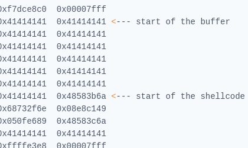

# GDB
gdb gef makes it so easy

```text-plain
gdb-gef hacktheworld
pattern create 1000
r
"paste"
pattern search $rsp
done
```

In 64 bit programs we see RIP doesn’t contain our sequence. In 64 bit, it will not pop a value into RIP if it cannot actually jump to and execute at that address. So the value is technically sitting at the top of the stack after popping it into RIP failed, so we get our value from RSP. so, we need to do rbp+8

`checkse <filename>`

To find the print\_flag() funtion, type this command into gdb:

`print& print_flag`

```text-plain
gef➤ pattern create -n 4 128
gef➤ pattern search 0x6161616161616167
gef➤ pattern search $rbp
gef➤ pattern search aaaaaaac
gef➤ run $(python -c "print('A'*155)")
```

check for overwritting `\x41` in return address 

dump of the hex code with the command `x/100x $rsp-200` which dumps 100\*4 bytes from memory location $rsp -200 bytes.



To calculate the exact address where the shell code starts, you first take the memory address on the left on the same line : 0x7fffffffe2a8. This is the address of the first column on this line (filed with 41 at the moment). And then you add 4 bytes per column. Our shell code is 3 columns further so you need to add 3\*4= 12 bytes to that address.

In hex 12 is 0xC, you need to do 0x7fffffffe2a + 0xC = 0x7fffffffe2b4