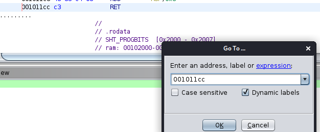

# Ghidra
[https://ghidra-sre.org/CheatSheet.html](https://ghidra-sre.org/CheatSheet.html) 

Double click variable in main function to go binary, use ctrl+shift+G to edit hex value.

`Program Trees -> exploit_me -> .got.plt`

I'll use **gets** as my leak function. Now we have our argument ready, and the only thing we need to do is pass it to the puts function. But how do we call puts?

We can find **puts** in the procedure linkage table (PLT) and call it from there. I won't be talking about PLT here, but we need to know where to find this PLT section in Ghidra. If you want to learn more about PLT and even some more about GOT, you can watch a fantastic video from LiveOverflow called Global Offset Table (GOT) and Procedure Linkage Table (PLT) on YouTube, which I recommend.

Searching
---------

Ghidra supports going to different portions of memory, when given a memory address. Click Navigation(At the top bar)->Go To and input a memory address.

Example:

press `S` to search for strings, go the the string instruction, right click and show reference to and then check out the function.

[https://materials.rangeforce.com/tutorial/2020/04/12/Patching-Binaries/](https://materials.rangeforce.com/tutorial/2020/04/12/Patching-Binaries/)

To patch a binary, just right click and patch instruction(or Ctrl+Shift+G) and edit the instruction out(JNZ to JZ), then go into display script manager(green start button) and use the script savepatch.py to save the patched binary, then just run and see the magic happen :).

find when we are using the **printf** function.

> Symbol Tree -> Functions -> printf