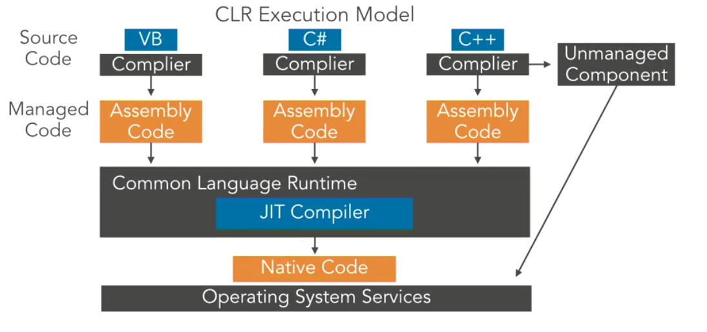

# .NET
.NET uses a run-time environment known as the Common Language Runtime (CLR). We can use any .NET language (C#, PowerShell, etc.) to compile into the Common Intermediary Language (CIL). NET also interfaces directly with Win32 and API calls making the optimal solution for Windows application development and offensive tool development.

.NET consists of two different branches with different purposes, outlined below.

*   .NET Framework (Windows only)
*   .NET Core (Cross-Compatible)

The main component of .NET is .NET assemblies. .NET assemblies are compiled .exes and .dlls that any .NET language can execute.

The CLR will compile the CIL into native machine code. You can find the flow of code within .NET below.

.NET Language → CIL/MSIL → CLR → machine code

