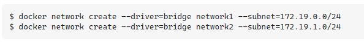

# Docker
They are closer to being chroot jails than they are to being VMs, that's for sure. Containers on \*nix systems are effectively just process namespaces -- in other words, the processes are segregated _but_ if you use `ps aux` on the host you'll still see them in the list. Containers on Windows run off hyper-v, so I suspect they _are_ closer to being VMs

Containers are also supposed to (by convention primarily) only actually run one process -- e.g. a webserver, So, a containerised web stack, for example, would use a bunch of different containers -- a webapp container, a database container, and probably a cache container at minimum

Docker containers _can_ run all three at once, but it's very much not recommended.

Credentials for a docker registry could either be phished or extracted from `/root/.docker/config.json` as, this location stores the credentials used with the `docker login` command in plaintext. This won't work in this case though, as the host we compromised doesn't have internet access and there are no credentials in `/root/.docker/config.json`.  
 

The workaround requires adding a non-privileged user to the `docker`group which, allows that user to run containers without using `sudo` or having root privileges. However, this also grants effective root-level privileges to the provided user, as they are able to spawn containers without restriction.

```text-plain
docker run -it --entrypoint=/bin/bash -v /:/mnt/ ghcr.io/jroo1053/ctfscoreapache:master
```

