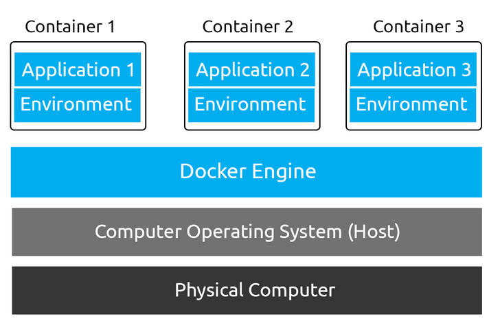
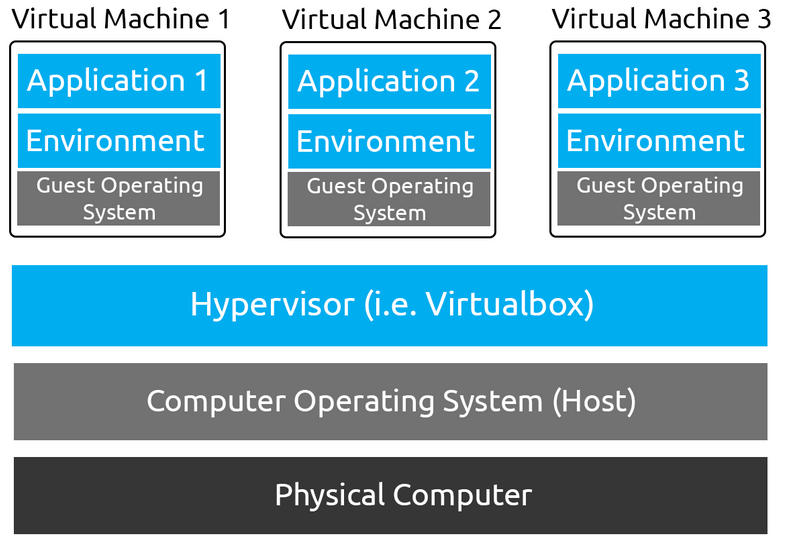

# Theory
Starting in 2013, Docker was introduced to solve the costly and time-consuming process of application development and service delivery. Docker employs what is currently a "hot potato" topic for developers: containerization, this technology separates applications into their own containers, where they share the resources of, but interact with the operating system independently of each other.

**Docker:**

*   Is extremely portable, if a computer can run Docker, it can run a Docker container. This means that developers only have to write the application once for multiple devices - a very big headache solved!
*   Has a considerably less resource usage per-container then Virtual Machines (VMs) I.e. RAM and CPU (we'll come onto this later)
*   Allows you to set up a complex environment in a few simple steps through Dockerfiles (again, we'll come onto this later)
*   Is most importantly, very lucrative to a pentester as containerization has been so widely adopted in information technology today.

 

The "_Guest Operating System_" is where the resources are used up. For example,  a recommended minimum install size of Ubuntu is 20gb, if you were to run this for three applications, you'd require 60GB of storage. Whereas, a Ubuntu Docker image has the base size of around 180MB~. Containers can share base images too! Extremely space-efficient.

containers have networking capabilities and their own file storage. They achieve this by using three components of the Linux kernel:

*   Namespaces
*   Cgroups
*   OverlayFS

Every process running on Linux will be assigned two things:

*   A namespace
*   A process identifier (PID)

Namespaces are how containerization is achieved! Processes can only "see" the process that is in the same namespace - no conflicts in theory. Take Docker for example, every new container will be running as a new namespace, although the container may be running multiple applications (and in turn, processes).