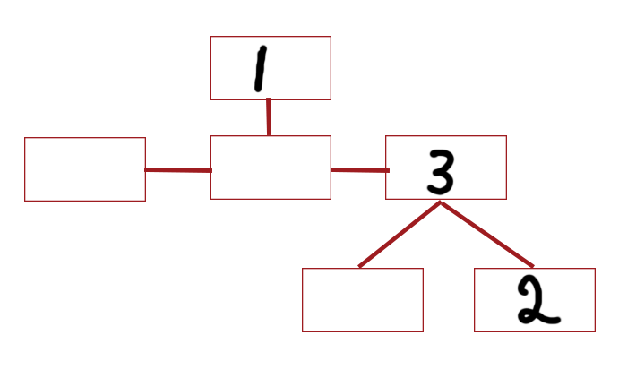

# snmp
The “**SNMP community string**” is like a user ID or password that allows access to a [router's](https://www.paessler.com/router_monitoring) or other device's statistics.

SNMP community strings are used only by devices which support the SNMPv1 and SNMPv2c protocol. SNMPv3 uses username/password authentication, along with an encryption key.

By convention, most SNMPv1-v2c equipment ships from the factory with a read-only community string set to “**public**”. It is standard practice for network managers to change all the community strings to customized values in the device setup.

`onesixtyone` can be used to bruteforce the community string like so:

```text-plain
onesixtyone <MACHINE-IP> -c /usr/share/seclists/Discovery/SNMP/snmp-onesixtyone.txt
```

after we find it, we could use a tool such as `snmp-check` which would dump everything automatically; 

using `snmp-check`

The information stored by SNMP is in a “tree” format, and is read from left to right. For example, in the string `1.3.2`, you would start at node one, then select the third node from the left out of its child nodes. Of _its_ children, you would select the second from the left.



The default location of the username list is: `1.3.6.1.4.1.77.1.2.25`, making our `snmp-walk` command:

snmpwalk -c <COMMUNITY> -v1 <MACHINE-IP> 1.3.6.1.4.1.77.1.2.25