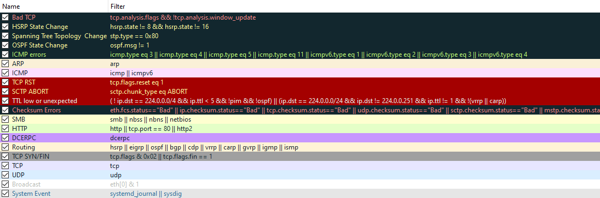

# Wireshark
IP Addresses
------------

`ip.addr == <IP Address>`

`ip.src == <SRC IP Address> and ip.dst == <DST IP Address>`

to see arp reply packets, set arp display filter and find `<ip> is at <mac>`

eth.addr == xx:xx:xx:xx:xx:xx (eth.addr == 80:fb:06:f0:45:d7 && arp)

**Use the IPv4 tab in the Endpoints (or Conversations) item under the Statistics menu** to see a list of unique hosts (or conversations).

For tls packet decryption when you have an ssl file, use [https://wiki.wireshark.org/TLS](https://wiki.wireshark.org/TLS) to import that file by going into edit→preferences→tls→(Pre)-Master-Secret log filename.

There are a few important things within the packet details that we can take note of first being the type and code of the packet. A type that equals 8 means that it is a request packet, if it is equal to 0 it is a reply packet. When these codes are altered or do not seem correct that is typically a sign of suspicious activity.



Exporting objects are available only for selected protocol's streams (DICOM, HTTP, IMF, SMB and TFTP).

SMTP
----

`smtp.response.code == 220` to narrow down the packet output using SMTP status codes

`smtp.response.code == 354` to check for attached files (right-click to follow tcp stream)

USB
---

To extract files from usb packets, first use:

```text-plain
tshark -r pcap2.pcapng -Y 'usb.capdata' -T fields -e usb.capdata > raw101.pcap
xxd -r -p raw101.pcap output.bin
binwalk -Me output.bin
```

this should extract the file into `_output.bin.extracted`. 

For USB letter tracing, there's a conversion mapping we can use to translate usb hex keys to raw text.