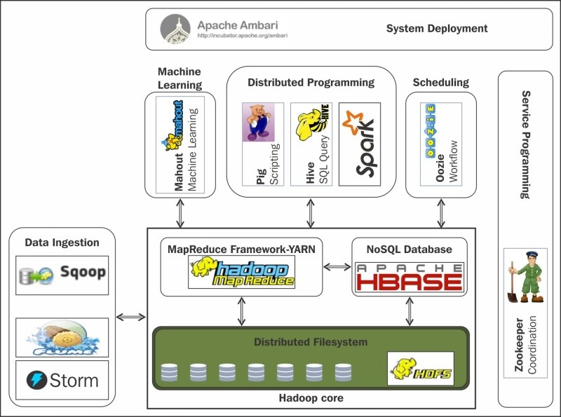

# theory
**Cluster** - Refers to all the systems that together make the datalake.  
**Node** - A single host or computer in the Hadoop cluster.  
**NameNode** - A node that is responsible for keeping the directory tree of the Hadoop file system.  
**DataNode** - A slave node that stores files according to the instructions of a NameNode.  
**Primary NameNode** - The current active node responsible for keeping the directory structure.  
**Secondary NameNode** - The backup node which will perform a seamless takeover of the directory structure should the Primary                                                      NameNode become unresponsive. There can be more than one Secondary NameNode in a cluster, but                                                    only one Primary active at any given time.  
**Master Node** - Any node that is executing a Hadoop "management" application such as HDFS Manager or YARN Resource                                             Manager.  
**Slave Node** - Any node that runs a Hadoop "worker" application such as HDFS or MapReduce. It should be noted that a single                                    node can be both a Master and Slave node at the same time.  
**Edge Node** - Any node that is hosting a Hadoop "user" application such as Zeppelin or Hue. These are applications that users can                            use to perform processing on the data stored in the datalake.  
**Kerberised** - The term given for a datalake that has security enabled through Kerberos.

Hadoop is a datalake technology developed by Apache. It is a collection of open-source applications and services that can utilise a network of computers to solve large and complex problems. Hadoop in its simplest form has two main functions namely distributed storage and distributed processing.

