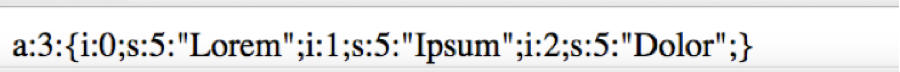
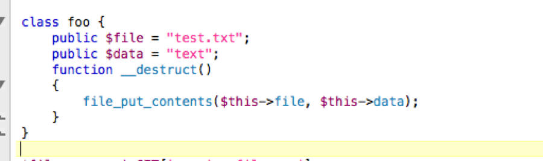

# theory

|     |     |
| --- | --- |
| a:3{ | Array of 3 values |
| i:0 | Integer, value \[ index-0\] |
| S:5:”Lorem” | String, 5 chars long, string value “Lorem” |
| i:1 | Integer, value \[index-1\] |
| S:5:”Ipsum” | String , 5 chars long, string value “Ipsum” |
| i:2 | Integer, value \[index-2\] |
| S:5:”Dolor” | String , 5 chars long, string value “Dolor” |

Un-serializing objects allows to control all properties a) public b) protected c) private, however un-serialized objects get woken up `__wakeup()` and later destroyed via `__destruct()`, and hence already existing code placed inside these\[wakeup,destruct\] magic function gets executed.

In our vulnerable program we have _destruct with a function file\__put\_contents:

Destruct with file\_put\_contents

So our payload looks like:

O:3:%22foo%22:2:{s:4:%22file%22;s:9:%22shell.php%22;s:4:%22data%22;s:5:%22aaaa%22;}

|     |     |
| --- | --- |
| O:3{: | \[ Object, takes 3 parameter with name foo\] |
| ”foo”: 2:{ | \[Parameter foo takes 2 values\] |
| S:4:”file”;s:9:”shell.php”; | \[String, 4 chars long, value “file”, string 9 chars long, value shell.php\] |
| s:4:"data";s:5:"aaaa";} | String, 4 chars long, string 5 chars long, value”aaaa” |

So when our above input string is un-serialized it allows controlling the properties of the class “foo”. An already existing code that is inside a magic method “`_destruct`” gets executed with our controlled values, in our case `file_put_contents`, creating a file “shell.php”.