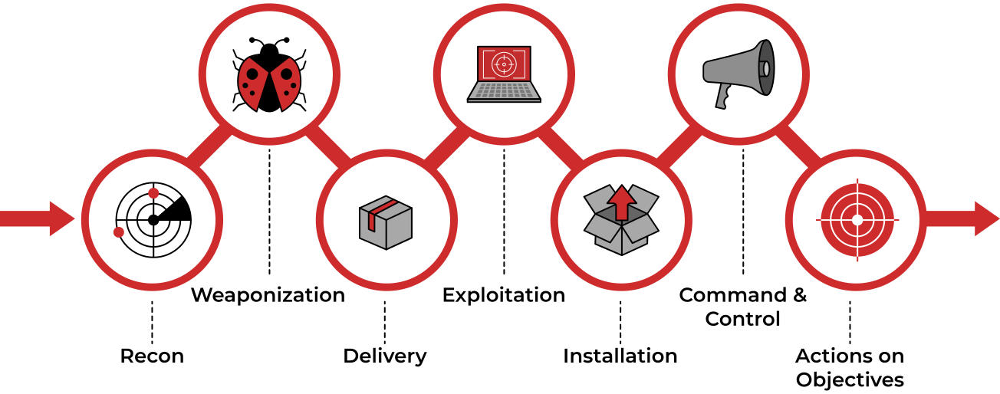

# Theory
|     |     |
| --- | --- |
| **Log Sources** | **Details** |
| **wineventlog** | It contains Windows Event logs |
| **winRegistry** | It contains the logs related to registry creation / modification / deletion etc. |
| **XmlWinEventLog** | It contains the sysmon event logs. It is a very important log source from an investigation point of view. |
| **fortigate\_utm** | It contains Fortinet Firewall logs |
| **iis** | It contains IIS web server logs |
| **Nessus:scan** | It contains the results from the Nessus vulnerability scanner. |
| **Suricata** | It contains the details of the alerts from the Suricata IDS.   This log source shows which alert was triggered and what caused the alert to get triggered— a very important log source for the Investigation. |
| **stream:http** | It contains the network flow related to http traffic. |
| **stream: DNS** | It contains the network flow related to DNS traffic. |
| **stream:icmp** | It contains the network flow related to icmp traffic. |

