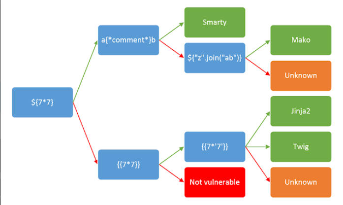
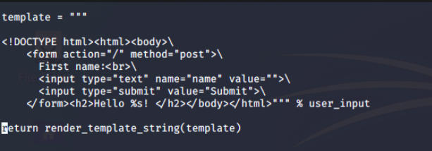

# SSTI
Server Side Template Injection, is when a user is able to pass in a parameter that can control the template engine that is running on the server

This introduces a vulnerability, as it allows a hacker to inject template code into the website. The effects of this can be devastating, from XSS, all the way to RCE.

`{{config}}`

Note: Different template engines have different injection payloads, however usually you can test for SSTI using {{2+2}} as a test.

`{{ ''.__class__.__mro__[2].__subclasses__()[40]()(<file>).read()}}` to read files on the server. Effectively all that payload does is load the file object in python, from there we can use basic file operations. Let's try to read /etc/passwd using this method from [https://github.com/swisskyrepo/PayloadsAllTheThings](https://github.com/swisskyrepo/PayloadsAllTheThings) 

We can use the code `{{config.__class__.__init__.__globals__['os'].popen(<command>).read()}}` to execute commands on the server. All that payload does is import the os module, and run a command using the popen method.

For automatic SSTI, [https://github.com/epinna/tplmap](https://github.com/epinna/tplmap) 

`./tplmap.py -u 'http://10.10.65.32/' -d 'name' --os-cmd 'ls /'`