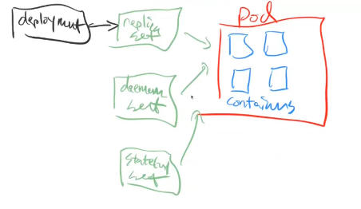

# Theory
[Kubernetes](https://kubernetes.io/docs/concepts/overview/what-is-kubernetes/), also known as K8s, is an open-source system for automating deployment, scaling, and management of containerized applications.

Kubernetes exposes an HTTP API to control the cluster. All resources in the cluster can be accessed and modified through this API. The easiest way to interact with the API is to use the `kubectl` CLI. You could also interact with the API directly using `curl` or `wget` if you don't have write access and `kubectl` is not already present, Here is a [good article](https://nieldw.medium.com/curling-the-kubernetes-api-server-d7675cfc398c) on that.

Role-based access control (RBAC) is **a method of restricting network access based on the roles of individual users within an enterprise**. RBAC ensures employees access only information they need to do their jobs and prevents them from accessing information that doesn't pertain to them.

You can't run kubectl without specifying an image.

