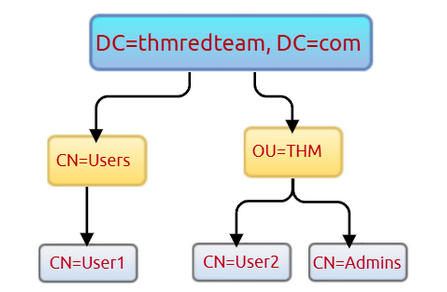

# ADUsers
Get-ADUser -Filter \* -SearchBase , "CN=User1,CN=Users,DC=thmredteam,DC=com"



Swap OU=THM and CN=Users in the searchBase string "CN=Users,DC=THMREDTEAM,DC=COM".

```text-plain
wmic /namespace:\\root\securitycenter2 path antivirusproduct
Get-CimInstance -Namespace root/SecurityCenter2 -ClassName AntivirusProduct
Get-MpComputerStatus | select RealTimeProtectionEnabled
Get-NetFirewallProfile | Format-Table Name, Enabled
Get-NetFirewallRule | select DisplayName, Enabled, Description
Test-NetConnection -ComputerName 127.0.0.1 -Port 80
```

```text-plain
 wmic service where "name like 'THM Demo'" get Name,PathName
```