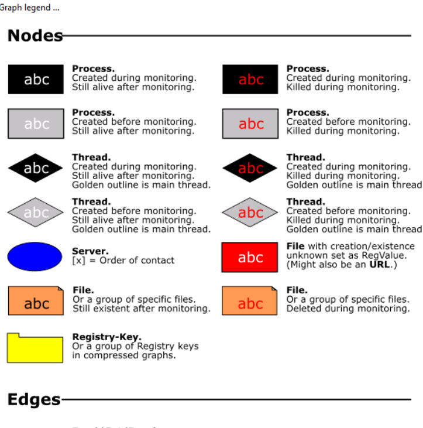
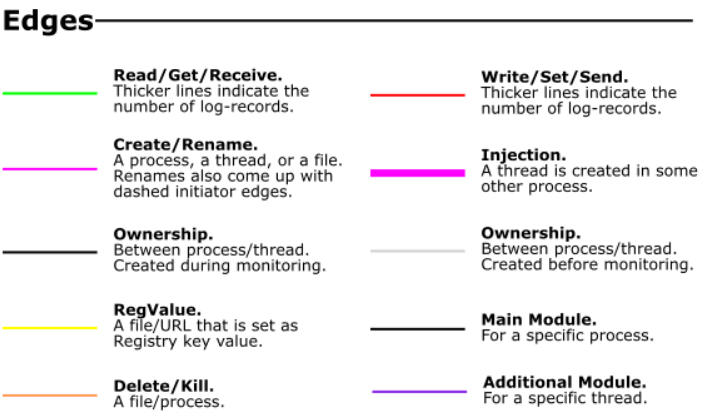

# Procdot
load `.csv` and `.pcap` files into `procmon` and `Windump` respectively, click elipses next to the launcher

In the launcher, there might be suspicous exe files (such as `exploreer.exe`)

if your going to zoom place the mouse cursor where you want to zoom and then press ctrl and mouse wheel up.

 

Click the next frames button and analyze the frames for interesting events such as (server events are blu oval, exe file events are red squares etc.,) the ips should be below the server names

To see user-agents, right-click and `follow tcp-stream` 

To find desktop wallpaper, search `Desktop` and right-click into “details” on the highlighted registry-key

Thread `4892` gives the PID of the process(The `PID:7128` is for `exploreer.exe`)

Looking around there is a registry key with `Z:` , right-click into details shows the full-path

Searching the C2 domain or virustotal and seeing the `community` tab, shows the ransomware name.