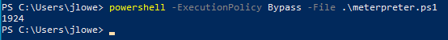

# Powershell

`Get-WinEvent -Path C:\Users\Administrator\Desktop\merged.evtx -FilterXPath "*/System/EventID=4104" -Oldest -MaxEvents 1 | Format-List`

 `1 | fl -property *` 

The "`Start-Process`" command can be used to start a process. You can see an example below for notepad.exe. `Get-Process` is useful to list all running processes.

Files can be copied and moved with “`Copy-Item`” and “`Move-Item`”, respectively.

The “`Get-Hotfix`” command can be used to enumerate already installed patches.

`Get-Hotfix | Format-list(Table) | findstr InstalledOn`

`Get-Process | Out-GridView`

`Get-NetGPO`

Find-Domainshare

Get-SmbShare

[https://book.hacktricks.xyz/windows/basic-powershell-for-pentesters/powerview](https://book.hacktricks.xyz/windows/basic-powershell-for-pentesters/powerview) 

Get-NetUser -UACFilter ACCOUNTDISABLE