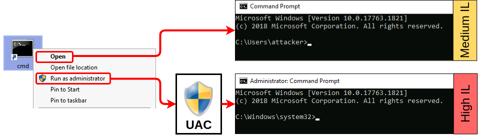

# Theory
### Integrity Levels

UAC is a **Mandatory Integrity Control (MIC)**, which is a mechanism that allows differentiating users, processes and resources by assigning an **Integrity Level (IL)** to each of them. In general terms, users or processes with a higher IL access token will be able to access resources with lower or equal ILs. MIC takes precedence over regular Windows DACLs, so you may be authorized to access a resource according to the DACL, but it won't matter if your IL isn't high enough.

The following 4 ILs are used by Windows, ordered from lowest to highest:  
 

|     |     |
| --- | --- |
| **Integrity Level** | **Use** |
| Low | Generally used for interaction with the Internet (i.e. Internet Explorer). Has very limited permissions. |
| Medium | Assigned to standard users and Administrators' filtered tokens. |
| High | Used by Administrators' elevated tokens if UAC is enabled. If UAC is disabled, all administrators will always use a high IL token. |
| System | Reserved for system use. |

When a process requires to access a resource, it will inherit the calling user's access token and its associated IL. The same occurs if a process forks a child.

### Filtered Tokens

To accomplish this separation of roles, UAC treats regular users and administrators in a slightly different way during logon:

*   **Non-administrators** will receive a single access token when logged in, which will be used for all tasks performed by the user. This token has Medium IL.
*   **Administrators** will receive two access tokens:
    *   **Filtered Token:** A token with Administrator privileges stripped, used for regular operations. This token has Medium IL.
    *   **Elevated Token:** A token with full Administrator privileges, used when something needs to be run with administrative privileges. This token has High IL.

In this way, administrators will use their filtered token unless they explicitly request administrative privileges via UAC.

### UAC Internals

At the heart of UAC, we have the **Application Information Service** or **Appinfo**. Whenever a user requires elevation, the following occurs:

1.  The user requests to run an application as administrator.
2.  A **ShellExecute** API call is made using the **runas** verb.
3.  The request gets forwarded to Appinfo to handle elevation.
4.  The application manifest is checked to see if AutoElevation is allowed (more on this later).
5.  Appinfo executes **consent.exe**, which shows the UAC prompt on a **secure desktop**. A secure desktop is simply a separate desktop that isolates processes from whatever is running in the actual user's desktop to avoid other processes from tampering with the UAC prompt in any way.
6.  If the user gives consent to run the application as administrator, the Appinfo service will execute the request using a user's Elevated Token. Appinfo will then set the parent process ID of the new process to point to the shell from which elevation was requested.

### Case study: Fodhelper

Fodhelper.exe is one of Windows default executables in charge of managing Windows optional features, including additional languages, applications not installed by default, or other operating system characteristics. Like most of the programs used for system configuration, fodhelper can auto elevate when using default UAC settings so that administrators won't be prompted for elevation when performing standard administrative tasks. While we've already taken a look at an autoElevate executable, unlike msconfig, fodhelper can be abused without having access to a GUI.

What was noticed about fodhelper is that it searches the registry for a specific key of interest:

  
 

When Windows opens a file, it checks the registry to know what application to use. The registry holds a key known as Programmatic ID (**ProgID**) for each filetype, where the corresponding application is associated. Let's say you try to open an HTML file. A part of the registry known as the **HKEY\_CLASSES\_ROOT** will be checked so that the system knows that it must use your preferred web client to open it. The command to use will be specified under the `shell/open/command` subkey for each file's ProgID. Taking the "htmlfile" ProgID as an example:

  
 

In reality, HKEY\_CLASSES\_ROOT is just a merged view of two different paths on the registry:

|     |     |
| --- | --- |
| **Path** | **Description** |
| HKEY\_LOCAL\_MACHINE\\Software\\Classes | System-wide file associations |
| HKEY\_CURRENT\_USER\\Software\\Classes | Active user's file associations |

When checking HKEY\_CLASSES\_ROOT, if there is a user-specific association at **HKEY\_CURRENT\_USER (HKCU)**, it will take priority. If no user-specific association is configured, then the system-wide association at **HKEY\_LOCAL\_MACHINE (HKLM)** will be used instead. This way, each user can choose their preferred applications separately if desired.  
 

Going back to fodhelper, we now see that it's trying to open a file under the ms-settings ProgID. By creating an association for that ProgID in the current user's context under HKCU, we will override the default system-wide association and, therefore, control which command is used to open the file. Since fodhelper is an autoElevate executable, any subprocess it spawns will inherit a high integrity token, effectively bypassing UAC.