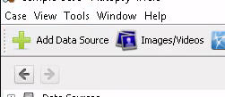
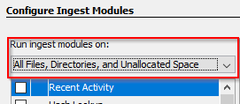
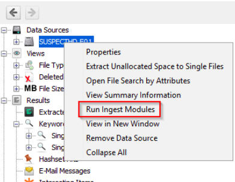

# autopsy
Your basic workflow:

1.  Create the case for the data source you will investigate
2.  Select the data source you wish to analyze
3.  Configure the ingest modules to extract specific artifacts from the data source
4.  Review the artifacts extracted by the ingest modules
5.  Create the report

By default, the Ingest Modules are configured to run on **All Files, Directories, and Unallocated Space**. 

 

Autopsy user interface, which is comprised of 5 primary areas: 

*   **Tree Viewer** (Left pane)
*   **Result Viewer** (Top right pane)
*   **Keyword Search** (Upper Top Right)
*   **Contents Viewer** (Bottom right pane)
*   **Status Area** (Lower Bottom right)

Q. What percent of disk is documents?

A. Go to “Data sources” in left tree, right click on "case.dd" and select “Summary Information” :)

For file events, go to tools timeline and events types event